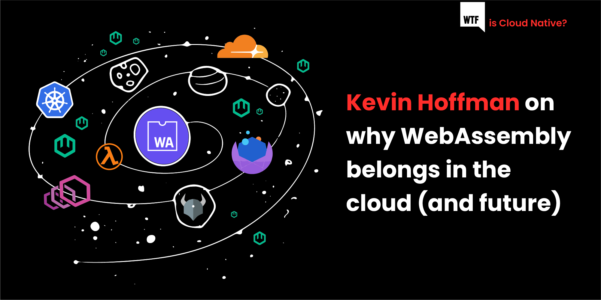

> 原文出处：[WebAssembly Where it Belongs: In the Cloud](https://blog.container-solutions.com/webassembly-in-the-cloud)
>
> 作者：[Kevin Hoffman](https://blog.container-solutions.com/author/kevin-hoffman)

在上一篇文章中，我们向你介绍了WebAssembly的基本原理。现在我们知道了WebAssembly是什么，是时候讨论它的归宿了，我们坚信，它是在云端。

## 什么使WebAssembly具有云的价值？

在前面的文章中，我们讨论了WebAssembly的一系列决定性属性。在这篇文章中，让我们来看看这些属性，看看是什么让它们在云中如此吸引人。

### 可移植性式

在云中，工作负载并不是静态的。与过去的虚拟机和数据中心不同的是，我们启动的东西不会永远保持在同一个地方运行。在云中，我们的工作负载在主机之间移动。当我们考虑被称为 "边缘" 的神话生物时，我们也希望我们的工作负载能够在后端和边缘的任何终端之间自由移动。

为了实现这一点，我们需要知道，我们的工作负载将在任何有足够资源的主机上工作。这就是为什么可移植性在云中是如此重要。

### 快速

时间就是金钱。我们不得不等待某些工作完成的时间越长，我们执行这项工作的成本就越高。更糟糕的是，如果我们让我们的客户等待，那么我们也有可能失去他们的钱。在上一篇文章中，我们讨论了WebAssembly虚拟机的高效、快速特性。我们从实验和基准测试知道，我们可以从WebAssembly模块中获得接近原生（或完全原生，取决于引擎）的性能。

### 小巧

当部署的单位很大时，有些事情我们根本无法做到。例如，你不能指望快速和轻松地运送一个1GB的Docker镜像，你当然也不能指望在不付出带宽和速度的代价的情况下，能够下载和启动这样一个镜像。

WebAssembly模块很小，而且是可流式的。这意味着我们部署的工作单元可以比我们现有的云部署的工作负载小得多，而且它可以实现以前不可能实现的部署和分发场景。我们可以将计算单元分布在信息中，这些信息可以比通常伴随着大型Web应用的典型JavaScript包更小。

### 安全

今天的现代云原生应用程序实行深度防御，即假设入侵者能够穿透你的基础设施的任何一层，因此你要在所有层建立安全。我们有一些工具可以在运行时监控系统，以防止它们执行未经授权的操作，但像WebAssembly模块这样独立的沙盒实体，除非主机运行时允许，否则它们不能做任何事情，也不能访问自己以外的任何内存。你甚至可以询问一个模块，确定它将向主机运行时请求哪些功能。这里没有惊喜，也没有办法劫持一个模块，让它做一些它不能做的事。

## 云端的WebAssembly

虽然许多人在阅读这篇文章时可能听说过WebAssembly在浏览器中运行，但从云端到边缘，到处都有一些惊人的创新，都是利用我们刚才讨论的WebAssembly的引人注目的品质。

有一些提供边缘计算的公司正在提供基于WebAssembly的函数执行，有一些开源项目和公司正在开发整个高层开发框架，旨在改变我们构建分布式应用的方式，有一些传统的云供应商，如AWS和谷歌，在他们的云中提供WebAssembly函数执行，甚至还有Kubernetes社区的一个萌芽部分，探索如何将基于WebAssembly的工作负载与容器调度平台结合起来。

### 边缘计算

边缘计算是在用户的物理位置或执行所需的数据源附近进行的代码执行。人们需要边缘计算，因为我们对计算能力和性能的要求从未停止过。我们想要一切，而且我们想要比以前更快。

想想一个机器学习应用，它分析视频的每一帧来检测物体。如果分析器靠近（网络方面）视频帧的源头，我们就可以在用户观看视频时，在用户所在的地方实时完成这项工作。如果没有边缘计算，这将成为一个缓慢、乏味的过程，整个视频被提交处理，我们在排队等咖啡后最终得到结果。

边缘计算最近越来越受欢迎，有许多公司提供边缘网络，用于从静态内容交付到这些交付网络边缘的代码执行。这些边缘网络现在支持WebAssembly，接受其微小的尺寸、安全性和性能。

以边缘计算服务著称的Fastly公司最近在其 [Compute@Edge](https://docs.fastly.com/products/compute-at-edge) 产品中支持在其边缘网络上运行以WASI（WebAssembly系统接口）编译的代码。你可以使用Rust或AssemblyScript等语言来编写代码，这些代码在边缘运行，靠近用户，利用Fastly的库，处理附近的数据，并与传统的后端进行通信。Fastly是字节码联盟（Bytecode Alliance）的成员（该联盟是由对WebAssembly的成功具有既得利益的公司组成的多行业团体），并通过该成员资格积极支持WebAssembly社区，为运行时和工具开发做出贡献。

