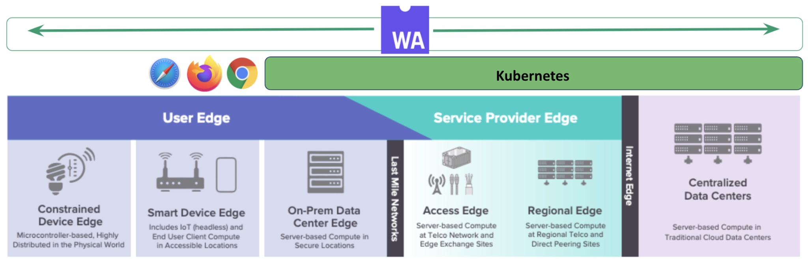

> 原文出处：[WebAssembly: The Future of Cloud Native Distributed Computing](https://thenewstack.io/webassembly-the-future-of-cloud-native-distributed-computing/)
>
> 演讲视频：https://www.youtube.com/watch?v=HPA8qmsHQfc
>
> 作者：Liam Randall, Wasmcloud创始人

WebAssembly已经成为2021年增长最快的云原生趋势之一。随着wasmCloud（今夏由Cosmonic捐赠的云原生计算基金会/CNCF沙盒项目）等分布式应用运行时的出现，我们看到WebAssembly出现在服务器和边缘，作为一个可扩展的平台嵌入到Envoy等平台，并通过Krustlet等项目成为直接的云原生编排目标，Krustlet项目最近被CNCF沙盒接受。

阻碍分布式应用开发、部署和维护的挑战催生了一种新的模式，其中WebAssembly在未来的云原生分布式计算中发挥着突出作用。

WebAssembly是一个小型和可移植的虚拟机，可以在现代网络浏览器、服务器和大量不同的硬件上运行。这个开放的WC3标准快速而高效，是各种编程语言支持的编译目标，包括Rust、C/C++、Typescript、Go等。

简称Wasm，这个开放的网络标准重视能力驱动的安全性，这意味着所有的应用程序在沙盒中启动时，沙盒必须不可默认，应用程序必须被授予明确的能力访问。它最初是在Mozilla工作室内部孵化的，现在由字节码联盟管理，作为网络浏览器中的JavaScript的补充，独立和云原生的Wasm。Wasm已经超越了浏览器，在整个云原生生态系统中的受欢迎程度正在上升。

WebAssembly的关键价值主张：

| 主张 |               描述                                               |
| -------------------------------------- | ------------------------------------------------------------ |
| **高效快速**              | 快速的启动时间使Wasm成为按需扩展的理想选择，其执行速度接近原生速度。 |
| **安全可靠**   | 在不容许默认的环境中被沙箱和操作，对个别能力的明确访问需要被授权 |
| **开放可调试**         | Wasm是一个社区驱动的WC3标准，由字节码联盟负责管理。 |
| **多语言**                           | 选择你自己的语言，你可以把经过测试的库带到一个领域。 |
| **可移植**                  | WebAssembly是一个编译目标，可以在多种环境下运行--服务器、浏览器、嵌入式设备。作为一个安全的沙盒，Wasm也可以被嵌入到其他应用程序内，使其成为执行其他代码的理想选择。 |

就其本身而言，WebAssembly为现代开发环境带来了新的功能和额外的安全特性--无论是在浏览器中还是在云原生中。然而，现代云原生开发人员面临着新的挑战，如CPU多样性、多种运维环境、安全性、分布式应用架构和可扩展性，这些挑战超越了部署到单一的公共云供应商。

要了解现代分布式计算环境，就必须考虑公共云内部不断上升的多样性，我们看到新的ARM CPU挑战x86芯片组的历史主导地位，在成本和性能方面展开竞争。

传统的企业系统通常将软件编译到特定的开发环境中，包括CPU和操作系统，如Linux-32位、MacOS-ARM64或Windows-64位。从公共云向边缘看去，我们发现在各种CPU架构上的执行环境更加多样化。

这包括我们选择不运行或不能运行Linux的地方，如小型设备、网络浏览器内或苹果的IOS系统上。WebAssembly给开发者提供了一个可移植的基础，同时针对操作系统和芯片组的不同组合，并实现了一次编写，到处运行的承诺。

Linux基金会的Edge工作组已经将这些串联起来，这是一个我们可以用来作为起点的世界观。

这种对世界的看法有助于我们框定现代分布式计算的复杂性。有许多不同的设备类型--有各种系统架构和能力，但这些类别实际上低估了复杂性。

如果我们稍微注释一下这个观点，将一些额外的背景与生态系统中现有的和常见的一些平台结合起来，我们就会得到一个我们需要考虑的更完整和复杂的世界观。

在公有云和服务提供商那里，我们发现了Kubernetes--有常规的和微型的。 我们发现在Kubernetes之上的容器中托管的应用程序，这些容器是在考虑到特定的操作系统和CPU架构的情况下构建和发布的。 我们应该在我们的生态系统中包括开发者环境，而包括移动设备意味着我们需要支持手机、浏览器、智能电视和所有其他的物联网（IoT）。

即使是真正的小东西--具有微小的能力。而且，虽然Kubernetes和Linux在公有云中占主导地位，而且越来越向边缘发展，但有一个计算的下限，让我们可能选择或不能部署它们。

当然，保护这个庞大的组合变得无比复杂，在分布式云原生边缘上有不同的细微差别和安全方法。WebAssembly的能力驱动安全方法将安全边界从流程中移出，我们在今天流行的容器驱动格式中发现它，并将其移到WebAssembly安全沙箱中。虽然技术上有差异，但WebAssembly与今天的企业环境兼容，可以与之结合使用。

## 分布式计算的挑战

在上一个技术时代，微服务和SaaS应用在公有云中集中托管的部署一直占主导地位。我们有令人信服的理由相信，下一个技术时代将由分布式应用主导。系统架构的多样性、应用架构的多样性、分布式安全、离线使用以及部署在边缘的机器学习正在继续推动分布式计算的崛起。

连接到互联网的设备数量和令人难以置信的多样性都在继续激增，因为我们正朝着2030年预计有500亿台连接设备的方向发展，企业的整合任务因十几种流行的、不兼容的CPU架构而变得更加复杂。其中每一种都有自己相对独特的操作生命周期，并来自几十个主要制造商。

WebAssembly有能力在这种复杂的环境中运行--Wasm运行时甚至可以被优化，以适应特定情况下的应用。例如，Bytecote联盟的Wasmtime为服务器端执行进行了大量的优化，Wasm-micro-runtime（WAMR）为较小的嵌入式设备进行了优化。

分布式和连接式系统的庞大集合将在巨大的不同应用架构中相互连接。N层应用、模型-视图-控制器、Pub/Sub、微服务等等。

在家庭、现代企业，甚至在我们社会的日常互动中，现代应用越来越多的是对等的，而不是客户端-服务器。点对点意味着兼容而复杂的逻辑，而微服务将需要在整个不同的生态系统中部署。

Wasm在这方面也很出色--其接近原生的性能使其成为独立、嵌入式或其他类型集成的理想选择。可移植性和一次编写到处运行的方法为开发者提供了部署其应用程序的新能力。

这些庞大的分布式应用的安全性是一个广泛的话题，然而，WebAssembly的原生安全设计对于在连续的任何地方运行的分布式项目是一个受欢迎的补充。

WebAssembly本身具有沙盒的功能；当你想改编或把代码带到大量复杂的系统中时，它是很有帮助的。WebAssembly还接受了能力驱动安全的现代趋势，应用程序不再被授予其父辈的权利，而是被执行到一个拒绝默认的沙盒中。

人们很容易相信，当我们把数十亿的设备连接到互联网时，我们可以简单地把所有的功能卸载到远程API和服务上--这些可能是哑巴终端，连接到智能核心或智能边缘。

虽然边缘将继续把功能移到靠近用户的地方，以尽量减少性能影响，但有许多令人信服的理由相信，设备将被连接，并在离线或间歇性连接时仍然提供某种程度的功能。由于各种原因，真正复杂的逻辑将需要运行在终端设备上和内部。

1. 延迟和确定性问题意味着一些设备需要在本地做出反应，没有任何延迟，例如无人驾驶汽车需要即时反应。

2. 在视频、广播、音频、设备遥测等所有不同频谱的边缘可用的大量数据集，必须首先在数据所在的地方--设备上进行处理。我们将继续看到机器学习（ML）模型提取元数据，并运回公共云进行进一步分析。

3. 对隐私和安全日益增长的关注将使逻辑保持在边缘或设备本身--一些数据，如家中的原始麦克风或摄像头馈送，不应运出本地环境而不进行预处理。

4. 在对有限的或故意的自主性的需求中--一些设备将需要能够在缺乏连接的远程环境中运行。远在海上的船只，遥远的漫游者，或无人机。即使是与互联网连接的智能电器，在连接断续的情况下，也应该保持一定程度的功能。

5. 不断上升的监管问题，如GDPR和CCPA，是未来事情的开始。大科技在不久的将来会被进一步监管，这将影响到我们分布式软件系统设计中的位置和方式。

这意味着，到2030年，估计有500亿台联网设备将放大我们的工作负荷--这些设备可能很小，可能很便宜--但它们将变得越来越智能和复杂。由于上述原因，WebAssemblies一次编写到处运行，安全模式和可移植性肯定会使它成为未来基础设施的重要组成部分。
